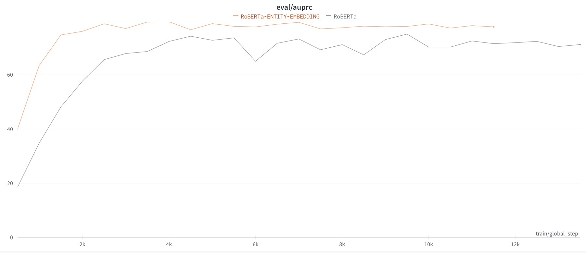

# Realation Extraction

문장 속 단어간의 관계성을 파악하는 Task를 말한다.  
이 Task의 목적은 관계성을 파악해 문장의 전체적인 의미나 의도를 해석하는데 도움을 줄 수 있다.  
관계추출은 지식 그래프 구축을 위한 핵심 구성 요소로, 구조화된 검색이나 감정 분석 혹은 질문에 답변, 요약과 같이 자연어처리 전반적인 Task에 도움을 줄 수 있다.

# Data

KLUE-RE-Datasets  

## features
- sentence : 문장
- subject_entity : subject entity의 단어, 위치, Type 정보
- object_entity : object entity의 단어, 위치, Type 정보
- Type : PER(사람), ORG(단체), POH(기타), LOC(장소), NOH(수량), DAT(날짜) 6가지 type
- label : subject와 object와의 실제 관계로 총 30개의 라벨로 분류


## The number of data
- total data : 총 32470개
- train data : total data의 90%
- valid data : total data의 10%
- test data : 총 7765개

<br>

## 실험

1. Back translation   
 한국어 문장 $\rightarrow$ 영어 문장 $\rightarrow$ 한국어 문장 의 과정을 통해 의미가 같지만 형태가 다른 문장 생성

2. Random Delete  
문장에서 적절한 일정 확률값으로 토큰을 제거하여 데이터를 증강

3. Entity Marker  
Entity의 정보 전달을 위해 마커 사용  
*[ENT]* 와 같이 스페셜 토큰을 사용하는 방법과 *@, #*과 같이 Punctuation을 사용하는 방법

<br>


# Models

## KLUE/BERT-BASE

<center></center>

- `Masked Language Modeling(MLM)`, `Next Sentence Prediction(NSP)`를 통한 사전학습

### Tokenizer

- __Wordpiece__

- vocab size : 32000

<br>

## KoELECTRA

<center></center>

<br>

- `Replaced Token Detection`을 기반으로 사전학습 된 모델

- __34GB의__ 한국어로 학습

### Tokenizer
- __Wordpiece__

- vocab size : 35000


<br>


## KLUE/RoBERTa-large

<center></center>

- remove `NSP`

- `Dynamic Masking` : 기존 `MLM`은 한번 씌운 mask를 반복적이게 사용하는 것을 보완

- Longer training time & Bigger Batch Size & Large data

### Tokenizer

- __Wordpiece__

- vocab size : 32000

<br>

## RoBERTa with Entity-Embeddings

<center></center>


- entity의 위치 정보를 넘겨 주기 위한 entity embedding layer 추가

<br>

## RoBERTa with Entity-type-Embeddings

<center></center>

- entity의 Type 정보를 넘겨 주기 위한 entity type embedding layer 추가

<br>

## RoBERTa with Specific Tokens

<center></center>

기존 방법은 *CLS*토큰의 vector를 사용해 분류를 했다면 entity 토큰들의 vector들의 평균값을 사용해 분류기를 태우는 작업 (관련 논문으로 R-BERT가 있다.)


<br>

## RoBERTa (Multi-Sentence-Tokenization)

input sentence에 *sub-entity와 obj-entity의 관계는?* 이라는 문장을 추가하여 사용하는 방법.


<br>

# 학습

- 학습

```
python3 train.py --config <config name>
```

- 추론

```
python3 inference.py --config <config name>
```


<br>


# Results


## BERT vs. RoBERTa vs. ELECTRA
<center></center>

- ELECTRA는 관계추출 Task에서 성능이 좋지 않은 것을 확인

<br>

## Entity Embedding vs. Entity Type Embeddings
<center></center>

- Entity Type Embedding을 사용하는것 보다 Entity Embedding만 사용하는 것이 효과적임

## RoBERTa with Entity Embeddings

<center></center>

- Entity Embedding을 추가한 모델이 성능이 높음

<br>

## RoBERTa with Specific Tokens

<center></center>

- *CLS* 뿐만 아니라 *Entity Tokens* 의 vector를 사용하는 것이 약간의 지표 향상을 보인다. 

<br>

## RoBERTa (Multi-sentence)

<center></center>

- input data에 문장을 추가하여 학습시키는게 성능 향상에 도움이 된다.

<br>


# Table (AUPRC)

|MODEL|AUPRC|
|:---:|:---:|
|BERT|74.812|
|ELECTRA|70.195|
|RoBERTa|75.029|
|RoBERTa with Entity|79.579|
|RoBERTa with Entity type|75.231|
|RoBERTa with Specific|75.424|
|RoBERTa(multi)|78.334|

<br>


# Conclusion

관계추출에서는 대체적으로 RoBERTa의 성능이 우수했다. Entity들의 관계를 분류하기 위해 다양한 시도를 하면서 내가 생각했던 방법론이 이미 논문으로 발표되어 있는 경우가 대다수 였다. 대회를 진행하며 생각보다 Entity Embedding모델이 성능을 발휘하지 못했는데 나중에 private결과를 보니 Entity Embedding 모델의 성능만이 증가하는 경험을 했다.  
public데이터에서는 다소 성능이 떨어졌지만 private 데이터에서 증가하는 모습을 보며 Entity embedding layer가 모델을 좀 더 robust하게 만들어주는 경험을 할 수 있었다.  
Specific 모델 즉, R-BERT와 같은 구조인 모델은 생각보다 성능이 나오지 않아 조금 더 연구해볼 필요가 있다.  
결과적으로 Entity embedding과 multi-sentence를 적용한 모델을 사용한것이 가장 성능이 좋았으며 대회는 종료되었지만 데이터 가공이나 전처리 부분에 조금 더 신경을 써 발전시킬 필요가 있다고 생각한다.